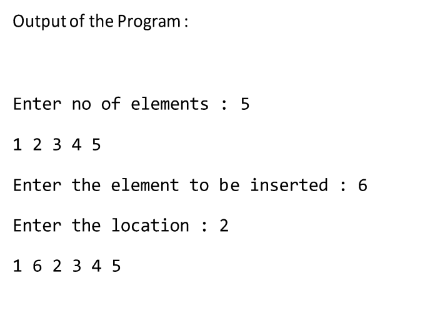

# Ex4 :
### 


# solution :
```c
#include <stdio.h>
void main()
{
    int index, val, i, j, size, arr[100] = {0};
    printf("enter number of elements : ");
    scanf("%d", &size);
    for (i = 0; i < size; i++)
    {
        arr[i] = i + 1;
    }
    printf("Enter the element to be inserted : ");
    scanf("%d", &val);
    printf("Enter the loation  : ");
    scanf("%d", &index);
    for (i = size; i > 0; i--)
    {
        if (i == index)
        {
            arr[i] = val;
            break;
        }
        arr[i] = arr[i - 1];
    }
    for (i = 0; i < size + 1; i++)
    {
        printf("%d\t", arr[i]);
    }
}

```
