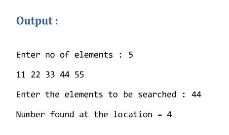

# Ex5 :


# solution :
```c
#include <stdio.h>
void main()
{
    int i, n, size, arr[100];
    printf("Enter number of elements : ");
    scanf("%d", &size);
    for (i = 0; i < size; i++)
    {
        arr[i] = 11 * (i + 1);
    }
    for (i = 0; i < size; i++)
    {
        printf("%d\t", arr[i]);
    }
    printf("\nEnter the number to be searched : ");
    scanf("%d", &n);
    if ((n / 11) > size)
    {
        printf("invalid number ");
    }
    else
    {
        printf("Number found in location %d\n", n / 11);
    }
}

```